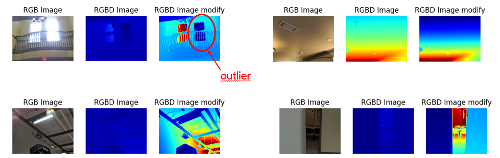
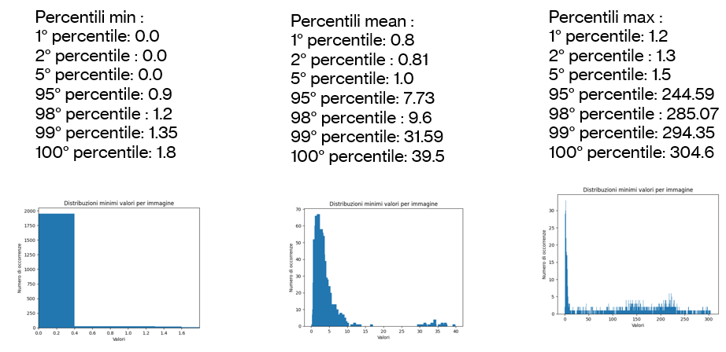
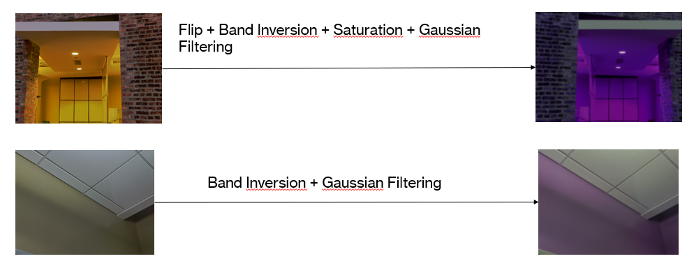
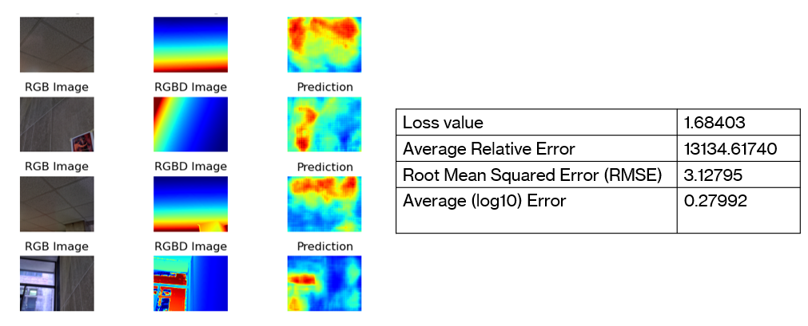
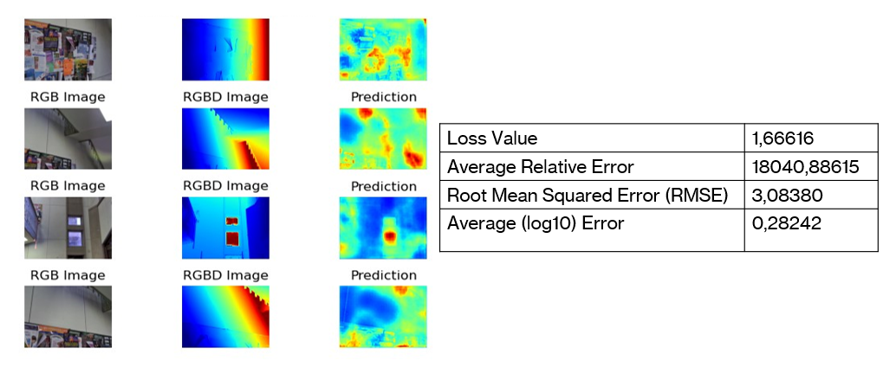
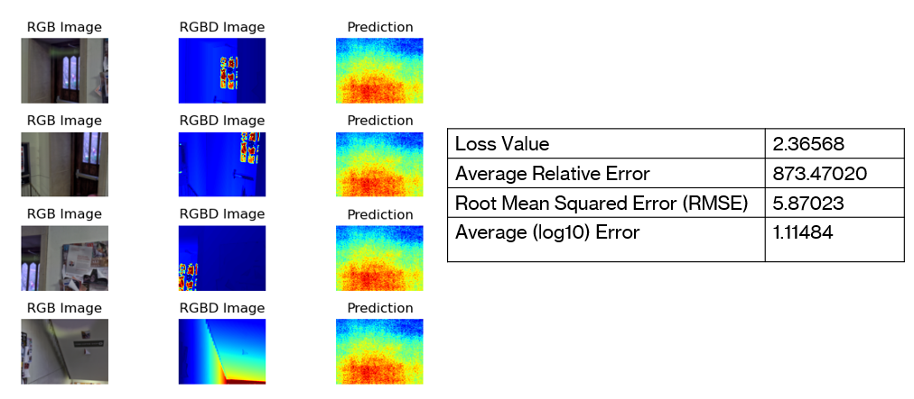
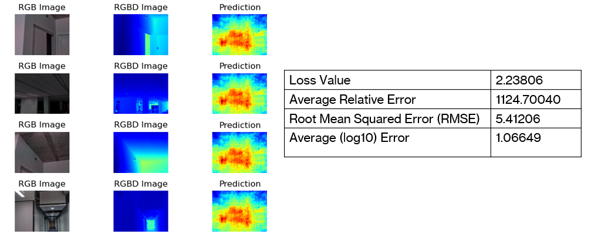
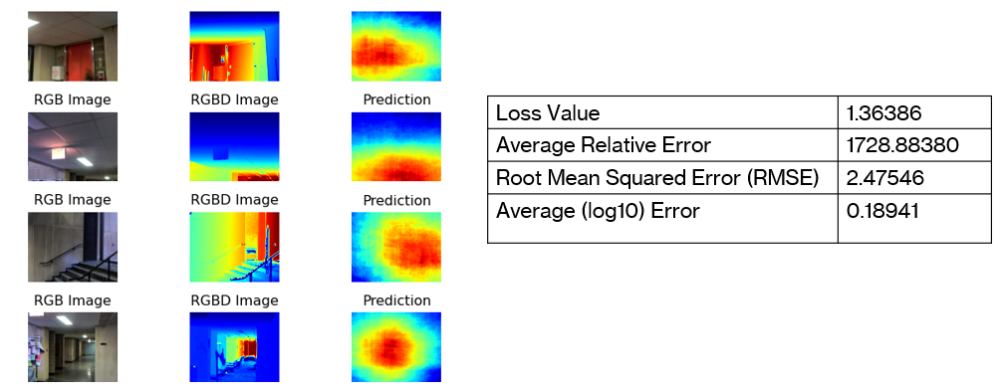

# Diode

The dataset used is a portion of the dataset from the DIODE paper (...) the dataset provided consists of 2k RGB images of indoor scenes, and as many files for the reactive mask and depth_map, for a total of 10GB. Indoor scenes are much easier than outdoor scenes as the range of values is smaller.

# Operation

In RGBD images, the red colour indicates that that pixel has a high value, while the blue colour indicates that that pixel has a low value.

## Clipping

We performed a clipping of the image values

## Analysis 

and decribe the min/max/mean value distribution [Analysis](FinalCode/_Analysis.ipynb)

## Augmentation

The following operations ([Augmentation](FinalCode/_Augmentation.ipynb)) were performed in combination, resulting in a 30% increase in dataset size:

- Horizontal flip
- Inversion of bands
- Saturation
- Gaussian filtering 

# Parameter

We define all parameters in [Configuration.yaml](hyp/Config.yaml)

# Models

- Encoder decoder with DenseNet121 like encoder

  
- Encoder decoder with DenseNet121 like encoder with skipp connection

  
- Plain Models

  
- Plain Models with VGG16

  
- Plain Models with VGG16 with leakyRelu

  

# Conclusion

- Complexity of the task in relation to poor data availability
- Insufficient hardware resources for training more massive models
- Difficulties in reconstructing the depth map
- Improvements through transfer learning in both Encoder-Decoder and plain architecture contexts
